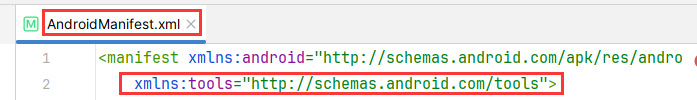
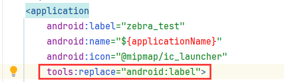

# pda_scanner

* 支持多种PDA扫码的插件

  已测试的型号有：

  ```text
  斑马：MC3300x
  海康威视(Hikivision)：DS-MDT201
  远望谷：不明确
  思必拓：T60
  ```
## 安装

将以下内容添加到你的pubspec.yaml文件中

```yaml
dependencies:
  pda_scanner:
   git:
    url: https://gitee.com/zengxingshun/flutter_plugin_pda_scanner.git
```

## 导入

```dart
import 'package:pda_scanner/pda_utils.dart';
```

## 一、使用PDA进行扫码

```dart
// 请在main函数的runApp调用之前初始化
void main(){
  PdaUtils.instance().init();
  runApp(const MyApp());
}
    
// 监听事件 可以监听多个事件 用tag进行区分
PdaUtils.instance().on("tag", (barcode) {
  // 接收回调的条码...
});

// 取消tag上的监听
PdaUtils.instance().off("tag");
```

### PDA扫码示例

```dart
import 'package:flutter/material.dart';
import 'package:pda_scanner/pda_utils.dart';

void main() {
  // 初始化PDA扫码
  PdaUtils.instance().init();
  runApp(MaterialApp(
    title: 'PDA扫码示例',
    theme: ThemeData(
      colorScheme: ColorScheme.fromSeed(seedColor: Colors.deepPurple),
      useMaterial3: true,
    ),
    home: const MyHomePage(title: 'PDA扫码示例'),
  ));
}

class MyHomePage extends StatefulWidget {
  const MyHomePage({super.key, required this.title});

  final String title;

  @override
  State<MyHomePage> createState() => _MyHomePageState();
}

class _MyHomePageState extends State<MyHomePage> {
  bool _dialogShow = false;

  @override
  Widget build(BuildContext context) {
    return Scaffold(
      appBar: AppBar(
        backgroundColor: Theme.of(context).colorScheme.inversePrimary,
        title: Text(widget.title),
      ),
      body: Center(
        child: Column(
          mainAxisAlignment: MainAxisAlignment.center,
          children: <Widget>[
            ElevatedButton(
              onPressed: () {
                // 监听事件 可以监听多个事件 用tag进行区分
                PdaUtils.instance().on("tag", (barcode) {
                  showDialogFunction(context, barcode);
                });
              },
              child: const Text("监听扫码事件"),
            ),
            ElevatedButton(
              onPressed: () {
                // 取消监听
                PdaUtils.instance().off("tag");
              },
              child: const Text("取消监听扫码事件"),
            )
          ],
        ),
      ),
    );
  }

  /// showDialog
  showDialogFunction(BuildContext context, String barcode) async {
    if (_dialogShow) {
      _dialogShow = false;
      Navigator.of(context).pop();
    }
    _dialogShow = true;
    await showDialog(
      context: context,
      builder: (BuildContext context) {
        return AlertDialog(
          title: const Text("条码内容"),
          content: Text(barcode),
        );
      },
    );
    _dialogShow = false;
  }
}
```

# 说明：

如果项目启动报如下错误

<span style="color:red">Suggestion: add 'tools:replace="android:label"' to \<application> element at AndroidManifest.xml:</span>

`解决方式`

在manifest标签加上 `xmlns:tools="http://schemas.android.com/tools"`

在application标签加上 `tools:replace="android:label"`

如图





## 例外：ZEBRA的PDA需要做以下额外配置，否则可能会引起闪退或其他意外情况。

您需要在您Flutter项目的安卓目录下的 <span style="color:red;font-weight:bold">  AndroidManifest.xml </span>中加入以下内容
### 1、在 `manifest` 节点下加入
```xml
<uses-permission android:name="com.symbol.emdk.permission.EMDK"/>
<queries>
    <package android:name="com.symbol.emdk.emdkservice" />
</queries>
```
### 2、在 `application` 节点下加入

```xml
<uses-library android:name="com.symbol.emdk" android:required="false"/>
<uses-library android:name="com.rscja.scanner" android:required="false"/>
```

### 3、在项目\android\app下新建 libs 文件夹

将  `emdk-11.0.129.jar` 放入该文件夹中，可在zebra官方进行下载  或者在我提供的assets中进行下载。

在项目app下的build.gradle文件的dependencies下添加

```groovy
// 斑马PDA
compileOnly files ('libs/emdk-11.0.129.jar')
```

以下为Zebra相关问题：

[android - How to use Zebra EMDK in release build? - Stack Overflow](https://stackoverflow.com/questions/70899282/how-to-use-zebra-emdk-in-release-build)

[Zebra EMDK Setup - TechDocs](https://techdocs.zebra.com/emdk-for-android/latest/guide/setup/)

[Basic Scanning with Barcode API - TechDocs (zebra.com)](https://techdocs.zebra.com/emdk-for-android/11-0/tutorial/tutbasicscanningapi/)
