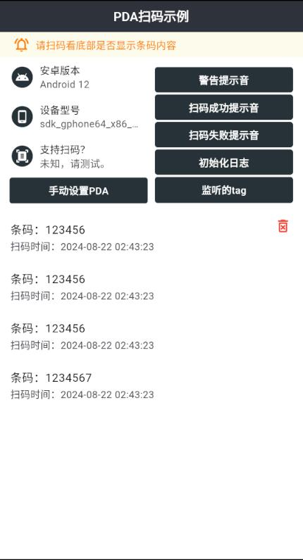
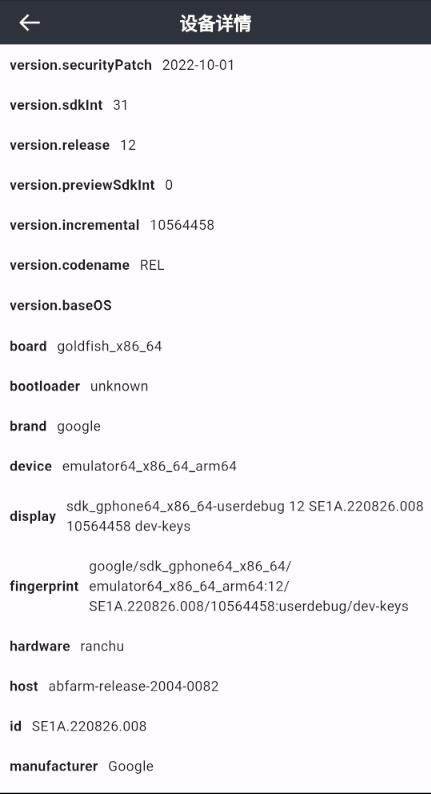
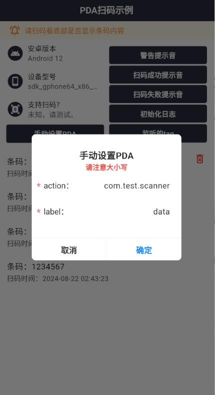

<h2 align="center" style="font-weight: bold;">flutter_plugin_pda_scanner v2.0.3</h1>

<h4 align="center">一款基于Flutter开发的支持多种PDA扫码的插件</h4>

<p align="center">
	<a href="https://gitee.com/zengxingshun/flutter_plugin_pda_scanner"></a>
	<a href="https://gitee.com/zengxingshun/flutter_plugin_pda_scanner/blob/master/LICENSE"></a>
    <a href=""></a>
    <a href="https://gitee.com/zengxingshun"></a>
    <a href="https://gitee.com/zengxingshun/flutter_plugin_pda_scanner/blob/master/LICENSE"></a>
</p>

# 一、介绍 ✨

这是一款专为Flutter开发者设计的PDA扫码插件，支持多种品牌和型号的PDA设备，包括但不限于斑马、海康威视、远望谷、思必拓和东集seuic等。插件提供了自动和手动两种初始化方式，以适应不同的开发需求和场景。

### 特点：

- **多设备支持**：经过测试，兼容多款主流PDA设备。
- **广播监听**：支持通过广播行为手动注册监听PDA扫码。
- **事件监听**：通过tag区分，可以同时监听多个扫码事件。
- **API丰富**：提供多种API，包括初始化、监听、关闭扫码器等。
- **声音提示**：包含成功、失败的声音提示功能。

### 使用方法：

1. **安装**：通过`pubspec.yaml`添加依赖。
2. **导入**：在Flutter项目中导入`pda_scanner`包。
3. **初始化**：在`main`函数中初始化插件，并使用`await`等待完成。
4. **监听事件**：通过`on`方法设置事件监听，使用tag作为标识。
5. **取消监听**：使用`off`方法取消特定tag的监听或`offAll`取消所有监听。

已测试的型号有：	

```text
斑马：MC3300x
海康威视(Hikivision)：DS-MDT201
远望谷：不明确
思必拓：T60
东集seuic：CRUISE2 5G
...
同时支持根据广播行为手动注册广播监听PDA扫码
```

**_可先 [下载](https://gitee.com/zengxingshun/flutter_plugin_pda_scanner/releases/download/V2.0.3/pda_scanner-V2.0.3.apk) 示例 app 进行测试，如需要集成 native 方式扫码的 PDA，请加我微信反馈，欢迎 fork 及 pr 。_**

|  |  |  |
| :------------------------------------------------: | :------------------------------------------------------: | :---------------------------------------------------------: |

➡ **如果是集成蓝牙扫码枪/USB扫码枪，请移步至另一个优秀开源库：[liyufengrex/flutter_scan_gun: flutter：usb 即插款扫码枪通用方案。](https://github.com/liyufengrex/flutter_scan_gun)**


# 二、使用方式 📔

## 1. 安装

将以下内容添加到你的 `pubspec.yaml` 文件中

```yaml
dependencies:
  pda_scanner:
   git:
    url: https://gitee.com/zengxingshun/flutter_plugin_pda_scanner.git
```

## 2. 导入

```dart
import 'package:pda_scanner/pda_utils.dart';
```

## 3. 初始化

* ### 自动初始化

```dart
// 请在main函数的runApp调用之前初始化
void main() async {
  await PdaUtils.init();
  runApp(const MyApp());
}
    
// 监听事件 可以监听多个事件 用tag进行区分
PdaUtils.on("tag", (barcode) {
  // 接收回调的条码...
});

// 取消tag上的监听
PdaUtils.off("tag");
```
* ### 手动初始化

```dart
// 传入广播action 和要获取的数据标签 label
await PdaUtils.initByCustom("com.action.scannersrvice....","data");

// 监听事件 可以监听多个事件 用tag进行区分
PdaUtils.on("tag", (barcode) {
  // 接收回调的条码...
});

// 取消tag上的监听
PdaUtils.off("tag");
```

**_这里的tag相当于一个id，每个界面定义一个唯一的标识，相当于标记哪个界面监听了扫码事件，页面销毁时也根据这个id取消监听，避免内存泄漏。_**

## 4. Api详情

api | 说明 | 调用示例
----- | ----- | -----
init|<div style="width:220px">初始化PDA插件，在runApp方法之前调用，注意：该方法内有大量异步操作，请结合await等待init操作完成。</div>|await PdaUtils.init();
initByCustom|<div style="width:220px">手动初始化PDA插件<br>action：广播行为<br>label：扫码内容获取标签</div>|await PdaUtils.initByCustom(action,label);
getInitLogList|获取初始化日志 |PdaUtils.getInitLogList();
isThisPDASupported|该PDA设备是否支持扫码 |PdaUtils.isThisPDASupported();
getPDAModel|获取设备型号名称|PdaUtils.getPDAModel();
getPlatformVersion|获取安卓系统版本|PdaUtils.getPlatformVersion();
on|<div style="width:220px">监听扫码事件，每次扫码事件传入tag字符串作为独立监听标识</div>|PdaUtils.on('tag',(barcode){...});
getOnTagList|获取订阅的tag标识列表|PdaUtils.getOnTagList();
off|取消对tag上的监听|PdaUtils.off('tag');
offAll|取消所有监听事件|PdaUtils.offAll();
errorSoundDudu|嘟嘟警告提示音|PdaUtils.errorSoundDudu();
successSoundHumanVoice|扫码成功的人声提示|PdaUtils.successSoundHumanVoice();
errorSoundHumanVoice|<div style="width:220px">扫码失败的人声提示，可传入bool类型参数playErrorSoundDudu，即播放失败人声时是否播放嘟嘟警告提示音，该参数默认为true</div>|PdaUtils.errorSoundHumanVoice();
navigateToSystemHome|<div style="width:220px">返回系统桌面，原生返回系统桌面后再进入app时会重启app，返回系统桌面时拦截调用该方法后不会有该情况</div>|PdaUtils.navigateToSystemHome();
closeScanner|手动关闭扫码器|PdaUtils.closeScanner();

## 5. PDA扫码示例

```dart
import 'package:flutter/material.dart';
import 'package:pda_scanner/pda_utils.dart';

void main() async {
  // 初始化PDA扫码 加上await关键字等待初始化完成
  await PdaUtils.init();
  runApp(MaterialApp(
    title: 'PDA扫码示例',
    theme: ThemeData(
      colorScheme: ColorScheme.fromSeed(seedColor: Colors.deepPurple),
      useMaterial3: true,
    ),
    home: const MyHomePage(title: 'PDA扫码示例'),
  ));
}

class MyHomePage extends StatefulWidget {
  const MyHomePage({super.key, required this.title});

  final String title;

  @override
  State<MyHomePage> createState() => _MyHomePageState();
}

class _MyHomePageState extends State<MyHomePage> {
  bool _dialogShow = false;

  @override
  Widget build(BuildContext context) {
    return Scaffold(
      appBar: AppBar(
        backgroundColor: Theme.of(context).colorScheme.inversePrimary,
        title: Text(widget.title),
      ),
      body: Center(
        child: Column(
          mainAxisAlignment: MainAxisAlignment.center,
          children: <Widget>[
            ElevatedButton(
              onPressed: () {
                // 监听事件 可以监听多个事件 用tag进行区分
                PdaUtils.on("tag", (barcode) {
                  showDialogFunction(context, barcode);
                });
              },
              child: const Text("监听扫码事件"),
            ),
            ElevatedButton(
              onPressed: () {
                // 取消监听
                PdaUtils.off("tag");
              },
              child: const Text("取消监听扫码事件"),
            )
          ],
        ),
      ),
    );
  }

  /// showDialog
  showDialogFunction(BuildContext context, String barcode) async {
    if (_dialogShow) {
      _dialogShow = false;
      Navigator.of(context).pop();
    }
    _dialogShow = true;
    await showDialog(
      context: context,
      builder: (BuildContext context) {
        return AlertDialog(
          title: const Text("条码内容"),
          content: Text(barcode),
        );
      },
    );
    _dialogShow = false;
  }
}
```


# 三、额外说明 ⚠

**_ZEBRA（斑马）的PDA发生闪退或其他情况则需要做以下额外配置，您需要在您Flutter项目的安卓目录下的 <span style="color:red;font-weight:bold">  AndroidManifest.xml </span>中加入以下内容_**

### 1、在 `manifest` 节点下加入
```xml
<uses-permission android:name="com.symbol.emdk.permission.EMDK"/>
<queries>
    <package android:name="com.symbol.emdk.emdkservice" />
</queries>
```
### 2、在 `application` 节点下加入

```xml
<uses-library android:name="com.symbol.emdk" android:required="false"/>
<uses-library android:name="com.rscja.scanner" android:required="false"/>
```

### 3、在项目\android\app下新建 libs 文件夹

将  `emdk-11.0.129.jar` 放入该文件夹中，可在zebra官方进行下载  或者在我提供的assets中进行下载。

在项目app下的build.gradle文件的dependencies下添加

```groovy
// 斑马PDA
compileOnly files ('libs/emdk-11.0.129.jar')
```

以下为Zebra相关问题：

[android - How to use Zebra EMDK in release build? - Stack Overflow](https://stackoverflow.com/questions/70899282/how-to-use-zebra-emdk-in-release-build)

[Zebra EMDK Setup - TechDocs](https://techdocs.zebra.com/emdk-for-android/latest/guide/setup/)

[Basic Scanning with Barcode API - TechDocs (zebra.com)](https://techdocs.zebra.com/emdk-for-android/11-0/tutorial/tutbasicscanningapi/)
